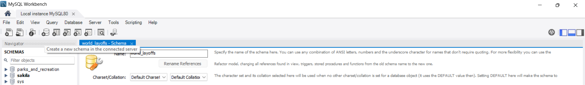

# Data-Cleaning-and-Preparation-of-Global-Layoffs-Dataset-Using-MySQL

#### Project Overview:
This project showcases a thorough data cleaning workflow applied to a real-world global layoffs dataset using MySQL. The raw data was transformed into a clean, standardized, and analysis-ready format through a series of SQL-based operations, reflecting real-world data engineering and ETL best practices.The dataset contains information on layoffs globally, including company, location, industry, total layoffs, percentage laid off, date, company stage, country, and funds raised. The raw data was imported into a MySQL schema named `world_layoffs` and cleaned to enable accurate exploratory data analysis.

---
### Technologies and Skills Demonstrated:
- MySQL database creation and management  
- Data import and export via MySQL Workbench  
- Advanced SQL window functions (`ROW_NUMBER()`, `PARTITION BY`)  
- String functions (`TRIM()`, `LIKE`, pattern matching)  
- Data type conversion (`STR_TO_DATE()`, `ALTER TABLE MODIFY`)  
- Self-joins for data imputation  
- Data filtering and deletion for quality assurance  

---
### Data Set Details:
- The dataset contains **2,361 records** of layoffs worldwide.
- Key columns include:
  - **Company**: Name of the company issuing layoffs.
  - **Location**: Geographic location of the layoffs.
  - **Industry**: Sector to which the company belongs.
  - **Total Laid Off**: Number of employees laid off.
  - **Percentage Laid Off**: Percentage of the workforce laid off.
  - **Date**: When the layoffs occurred (initially stored as text).
  - **Stage**: Company stage, such as Series B, Post-IPO, or unknown.
  - **Country**: Country of the layoffs.
  - **Funds Raised (Millions)**: Capital raised by the company.
- The dataset was sourced from a GitHub repository for easy access.

---

### Key Processes Performed:
1. **Duplicate Detection and Removal**: 
2. **Data Standardization**:  
3. **Handling Nulls and Missing Values**:   
4. **Date Formatting and Data Type Conversion**:  
5. **Column and Row Removal**:
  
---
## 🌟 Key Features & Methodologies
---
### Step 1: Creating Database and Importing Raw Data

- Created a new schema for the project:


- Imported the layoffs dataset into a table named `layoffs` using MySQL’s Table Data Import Wizard, keeping the raw data intact without modifying import settings (e.g., date imported as text).

---

### Step 2: Creating a Staging Table for Data Cleaning

To preserve raw data integrity and enable safe cleaning, a staging table was created by copying all data from the raw `layoffs` table:

```sql
CREATE TABLE layoffs_staging LIKE layoffs;

INSERT INTO layoffs_staging
SELECT * FROM layoffs;
```

This approach aligns with best practices to avoid direct modification of raw data.

---

### Step 3: Removing Duplicate Rows

Since the dataset lacked a unique identifier, duplicates were detected using a window function `ROW_NUMBER()` partitioned by all relevant columns to identify identical rows:

```sql
WITH duplicate_CTE AS (
  SELECT *,
    ROW_NUMBER() OVER (
      PARTITION BY company, location, industry, total_laid_off, percentage_laid_off, `date`, stage, entry, funds_raised_millions
      ORDER BY company
    ) AS row_num
  FROM layoffs_staging
)
SELECT * FROM duplicate_CTE WHERE row_num > 1;
```

After identifying duplicates, a new table `layoffs_staging_2` was created with an additional column `row_num`:

```sql
CREATE TABLE layoffs_staging_2 (
  company VARCHAR(255),
  location VARCHAR(255),
  industry VARCHAR(255),
  total_laid_off INT,
  percentage_laid_off FLOAT,
  `date` VARCHAR(50),
  stage VARCHAR(50),
  entry VARCHAR(50),
  funds_raised_millions FLOAT,
  row_num INT
);

INSERT INTO layoffs_staging_2
SELECT company, location, industry, total_laid_off, percentage_laid_off, `date`, stage, entry, funds_raised_millions, row_num
FROM (
  SELECT *,
    ROW_NUMBER() OVER (
      PARTITION BY company, location, industry, total_laid_off, percentage_laid_off, `date`, stage, entry, funds_raised_millions
      ORDER BY company
    ) AS row_num
  FROM layoffs_staging
) AS subquery;
```

Duplicates (rows where `row_num > 1`) were deleted from this table:

```sql
DELETE FROM layoffs_staging_2 WHERE row_num > 1;
```

Finally, the auxiliary column was dropped to clean up the schema:

```sql
ALTER TABLE layoffs_staging_2 DROP COLUMN row_num;
```

---

### Step 4: Standardizing Data

#### 4.1 Trimming Whitespace in Company Names

Whitespace inconsistencies were removed using the `TRIM()` function:

```sql
UPDATE layoffs_staging_2
SET company = TRIM(company);
```

#### 4.2 Normalizing Industry Labels

Example: Multiple variations of "crypto" such as "cryptocurrency", "crypto", and typos like "crypt" were standardized to "crypto" using pattern matching and update:

```sql
UPDATE layoffs_staging_2
SET industry = 'crypto'
WHERE industry LIKE 'crypto%';
```

#### 4.3 Fixing Country Names with Trailing Characters

A trailing period in some country names was removed using `TRIM(TRAILING ...)`:

```sql
UPDATE layoffs_staging_2
SET country = TRIM(TRAILING '.' FROM country)
WHERE country LIKE 'United States.%';
```

---

### Step 5: Converting Date Column from Text to Date Type

Because the `date` column was imported as text, it was converted to MySQL’s `DATE` type using `STR_TO_DATE()`:

```sql
UPDATE layoffs_staging_2
SET `date` = STR_TO_DATE(`date`, '%m/%d/%Y');
```

Then, the column was altered to enforce the `DATE` datatype:

```sql
ALTER TABLE layoffs_staging_2
MODIFY COLUMN `date` DATE;
```

---

### Step 6: Handling Null and Blank Values

#### 6.1 Identifying Nulls and Blanks

To find rows with null or blank values in critical columns like `industry`:

```sql
SELECT * FROM layoffs_staging_2
WHERE industry IS NULL OR industry = '';
```

#### 6.2 Populating Missing Industry Data by Self-Join

Rows with missing `industry` values were updated by joining on company and location to find corresponding non-null values:

```sql
UPDATE layoffs_staging_2 AS T1
JOIN layoffs_staging_2 AS T2
  ON T1.company = T2.company AND T1.location = T2.location
SET T1.industry = T2.industry
WHERE (T1.industry IS NULL OR T1.industry = '')
  AND T2.industry IS NOT NULL;
```

First, blanks were converted to `NULL` for consistency:

```sql
UPDATE layoffs_staging_2
SET industry = NULL
WHERE industry = '';
```

---

### Step 7: Removing Irrelevant Rows and Columns

Rows where both `total_laid_off` and `percentage_laid_off` are NULL were considered unreliable and deleted:

```sql
DELETE FROM layoffs_staging_2
WHERE total_laid_off IS NULL AND percentage_laid_off IS NULL;
```

---
### Project Outcome:
- Successfully transformed a raw, unstructured layoffs dataset into a clean, consistent, and reliable staging database.
- Enabled accurate and meaningful future **exploratory data analysis** by ensuring data integrity and standardization.
- Demonstrated practical, real-world techniques for cleaning data in MySQL, including handling duplicates, null values, inconsistent categories, and data type conversions.
- Developed a repeatable, professional workflow that preserves raw data and allows iterative cleaning without risk.
- Created a valuable portfolio project showcasing advanced SQL skills and data cleaning processes that are highly relevant to data engineering and analytics roles.
- Prepared the dataset for the next phase of analysis, where trends, patterns, and insights about layoffs across industries and geographies can be explored effectively.
---
### Summary

This project involved importing raw data, creating staging environments, removing duplicates via advanced window functions, standardizing textual data, converting data types appropriately, imputing missing values through self-joins, and cleaning irrelevant data. The SQL code was carefully crafted to reflect real-world data cleaning challenges and best practices.

With the cleaned `layoffs_staging_2` table ready, the dataset is now primed for advanced exploratory data analysis and insightful visualizations, forming a strong foundation for data-driven decision-making.

---


This detailed project description, combined with exact SQL queries, provides a transparent, technical narrative of the data cleaning process, making it ideal for showcasing your SQL proficiency in a portfolio.

